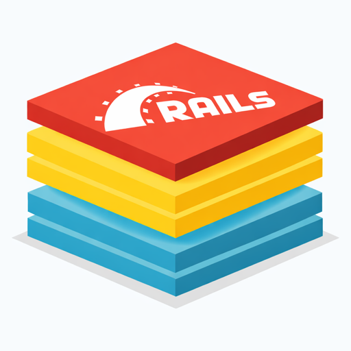

 

> _**Author's Note:** This is a work-in-progress. I wouldn't recommend using it just yet._

---

<p align="center">
  
  <br />
</p>

[](https://github.com/nschneble/rails-superstack/actions/workflows/ci.yml) [](http://creativecommons.org/publicdomain/zero/1.0)

Rails Superstack is a ready-to-go Ruby on Rails instance with front-end, database, and accouterments. __A majestic monolith with a f*ckton of useful gems.__ It's a free public template anyone can use to hit the ground running with their own app ideas.

- [Getting Started](#getting-started)
  - [Prerequisites](#prerequisites)
  - [Run Rename Script](#run-rename-script)
  - [Set Up Font Awesome](#set-up-font-awesome)
  - [Build and Run](#build-and-run)
- [What's in a Superstack, Exactly?](#whats-in-a-superstack-exactly)
  - [Tech Stack](#tech-stack)
  - [Gems and Resources](#gems-and-resources)
  - [Code Features](#code-features)
  - [Routes](#routes)
- [Linting, Testing, and CI](#linting-testing-and-ci)
  - [Linting](#linting)
  - [Testing](#testing)
  - [Local CI](#local-ci)
- [Acknowledgements](#acknowledgements)

## Getting Started
First things first. [Create a repository](https://docs.github.com/en/repositories/creating-and-managing-repositories/creating-a-repository-from-a-template#creating-a-repository-from-a-template) from this template. It's only two steps!
1. Click on "Use this template" above the file list
1. Select "Create a new repository"

Clone the new repo to your local machine, and you're done! (I suppose that's _technically_ three steps)

### Prerequisites
With your shiny new repo in hand, here's what you need to get cooking:
* PostgreSQL 14.20
* Ruby 3.4.7
* [Bundler](https://bundler.io/) 2.7.2

I'd personally recommend [Homebrew](https://brew.sh) and [rbenv](https://rbenv.org) to install these prerequisites:

```bash
cd /path/to/your/repo

# Install Homebrew + Postgres
/bin/bash -c "$(curl -fsSL https://raw.githubusercontent.com/Homebrew/install/HEAD/install.sh)"
brew install postgresql@14

# Install rbenv + Ruby
curl -fsSL https://rbenv.org/install.sh | bash
rbenv install 3.4.7

# Install Bundler
gem install bundler -v 2.7.2
```
### Run Rename Script
Unless you want your app to be called "Rails Superstack", you'll probably want to run this script:

```bash
cd /path/to/your/repo

# Preview changes
script/rename.sh --dry-run

# Run interactively
script/rename.sh

# Run without prompts
script/rename.sh --no-confirmation
```

The script should be clever enough to detect your new repo's origin url. If not, it'll prompt you for it. If _that_ fails, it'll prompt for your GitHub username and repository name.

After the script runs successfully, it'll delete itself and create a new README.

### Set Up Font Awesome
This one's easy. Navigate to [Get Started with Font Awesome](https://fontawesome.com/start) to sign up and add a new icon kit. Create a file for your environment variables using the included `.env.example` file, then plug in your shiny new kit:

```bash
cd /path/to/your/repo
cp .env.example .env
```

Open `.env` and replace `FONT_AWESOME_KIT_URL` with your kit's url.

### Build and Run
You can install dependencies, set up the database, run migrations – etc. etc. – or you can live on the wild side and just run the `setup` script:

```bash
cd /path/to/your/repo
bin/setup
```

That's it! Code away my sweet angelic butterfly.

## What's in a Superstack, Exactly?

### Tech Stack
Rails Superstack is installed by default with:
* [Ruby on Rails](https://rubyonrails.org)
* [Hotwire](https://hotwired.dev)
* [Postgres](https://www.postgresql.org)
* [Puma](https://puma.io)
* [Rubocop](https://rubocop.org)
* [Tailwind](https://tailwindcss.com)

### Gems and Resources
Rails Superstack has been preloaded and configured with the following:
* [Strong Migrations](https://github.com/ankane/strong_migrations) (catch unsafe migrations)
* [LogBench](https://github.com/silva96/log_bench) (log viewer)
* [RSpec](https://rspec.info) + [Factory Bot](https://github.com/thoughtbot/factory_bot_rails) + [Faker](https://github.com/faker-ruby/faker) (testing)
* [Passwordless](https://github.com/mikker/passwordless) (auth)
* [Letter Opener](https://github.com/ryanb/letter_opener) + [web interface](https://github.com/fgrehm/letter_opener_web) (preview emails)
* [Font Awesome](https://fontawesome.com) (icons)

### Code Features
| Feature            | Description |
| ------------------ | ----------- |
| Models             | [User](app/models/user.rb) |
| Helpers            | Text, web urls, forms, Font Awesome icons |
| Normalizers        | Email addresses |
| Validators         | Email addresses, web urls |
| View Components    | Static header + footer, clipboard button, toast notifications |

### Routes
| Endpoint     | Description                              |
| ------------ | ---------------------------------------- |
| `/sign_in`   | Sign in as a new user                    |
| `/sign_out`  | Sign out the current user                |
| `/sent_mail` | Preview sent mail in development         |
| `/notice`    | Sample endpoint for notice notifications |
| `/alert`     | Sample endpoint for alert notifications  |

## Linting, Testing, and CI
There's handy binstubs for RSpec and Rubocop. Local CI will mirror the GitHub workflow that runs when you make commits and merge pull requests.

### Linting
```bash
cd /path/to/your/repo

# Lint code for consistent style
bin/rubocop
```

### Testing
```bash
cd /path/to/your/repo

# Run RSpec tests
bin/rspec
```

### Local CI
```bash
cd /path/to/your/repo
bin/ci
```

## Acknowledgements
The Rails Superstack logo was crafted from an illustration by [Muhammad Afandi](https://unsplash.com/@kertiaa?utm_source=unsplash&utm_medium=referral&utm_content=creditCopyText) on [Unsplash](https://unsplash.com/illustrations/three-stacked-geometric-shapes-on-white-background-VxU_akYKA8Q?utm_source=unsplash&utm_medium=referral&utm_content=creditCopyText).
