<p align="center">
  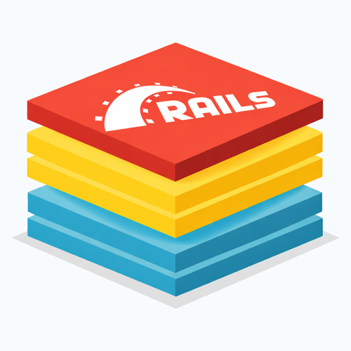
  <br />
</p>

# Rails Superstack

Rails Superstack is a ready-to-go Ruby on Rails instance with front-end, database, and accouterments. **A majestic monolith with a f\*ckton of useful gems.** It's a free public template anyone can use to hit the ground running with their own apps.

[](https://github.com/nschneble/rails-superstack/actions/workflows/ci.yml)  [](http://creativecommons.org/publicdomain/zero/1.0)

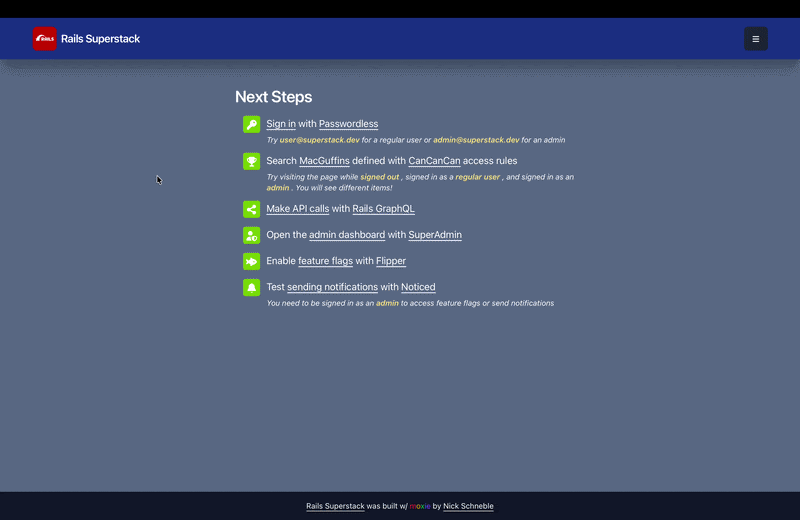

<p align="left">┌─ Click any image to enlarge ─┐</p>

<table>
  <tr>
    <td align="center">
      <a href="public/screenshots/welcome.jpg">
        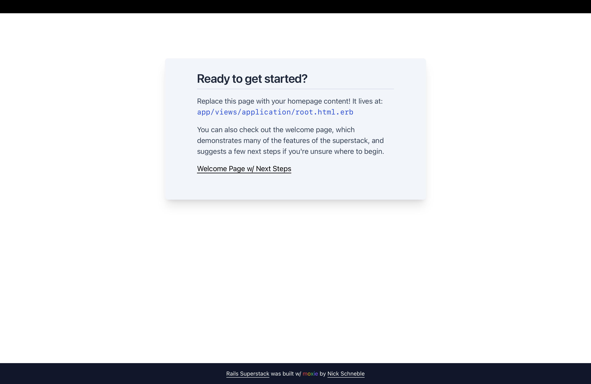
      </a>
      <br /><sub><b>Welcome Page</b></sub>
    </td>
    <td align="center">
      <a href="public/screenshots/superadmin.jpg">
        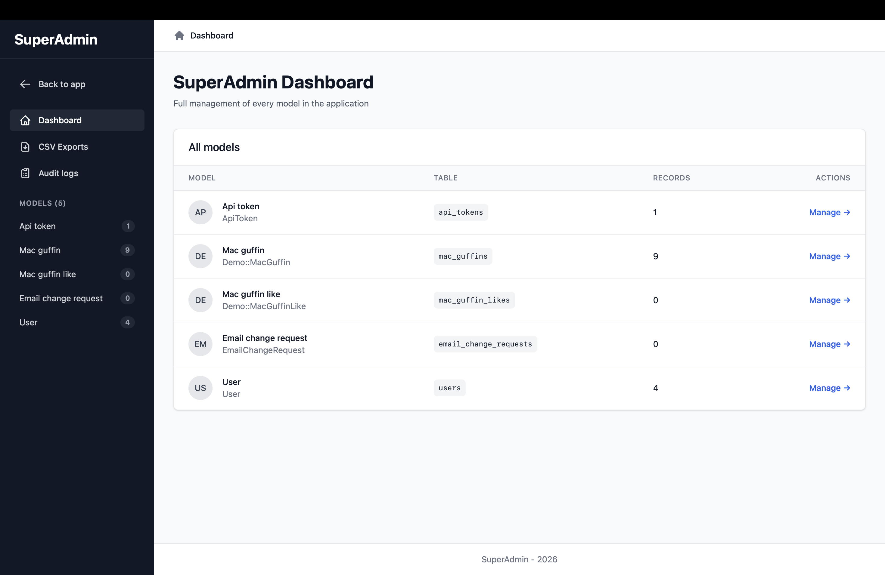
      </a>
      <br /><sub><b>SuperAdmin Dashboard</b></sub>
    </td>
    <td align="center">
      <a href="public/screenshots/resque.jpg">
        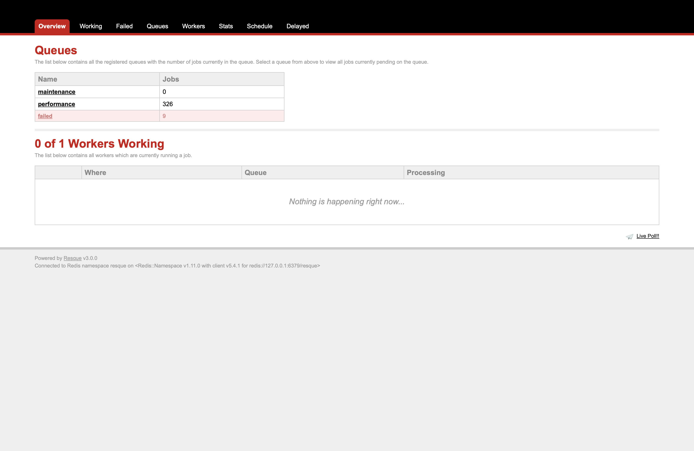
      </a>
      <br /><sub><b>Resque UI</b></sub>
    </td>
  </tr>
  <tr>
    <td align="center">
      <a href="public/screenshots/demo.jpg">
        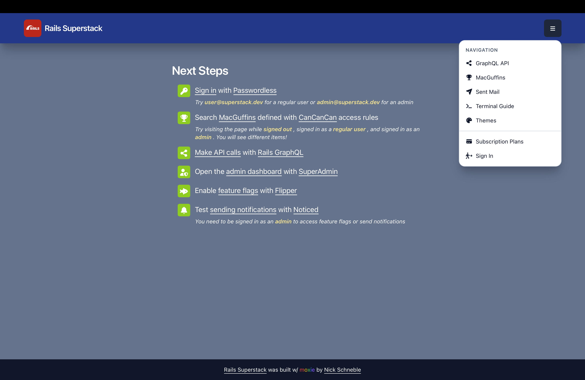
      </a>
      <br /><sub><b>Demo Page</b></sub>
    </td>
    <td align="center">
      <a href="public/screenshots/simplecov.jpg">
        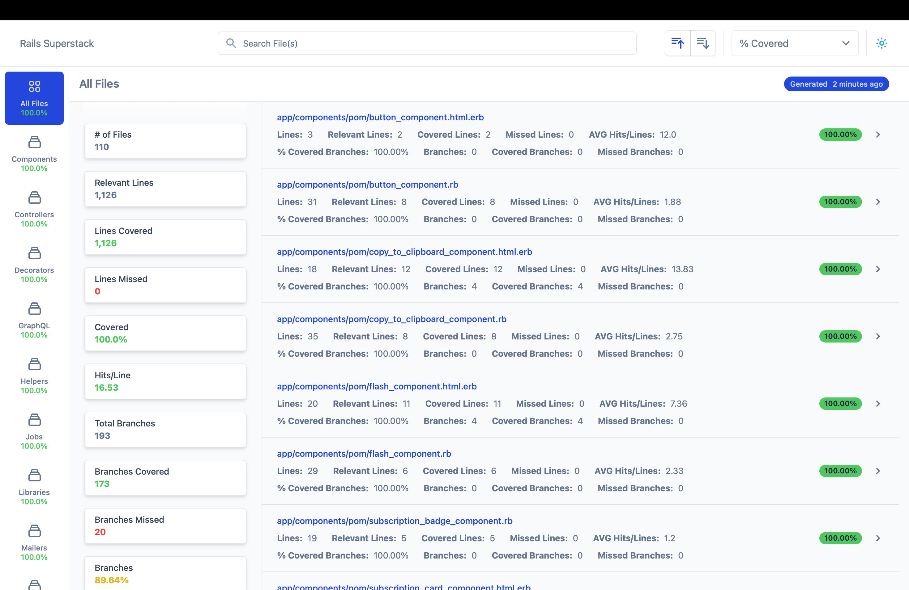
      </a>
      <br /><sub><b>SimpleCov Report</b></sub>
    </td>
    <td align="center">
      <a href="public/screenshots/rubycritic.jpg">
        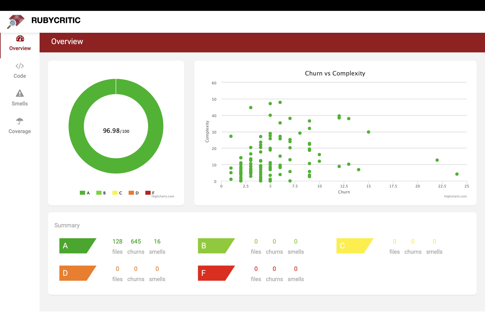
      </a>
      <br /><sub><b>RubyCritic Analysis</b></sub>
    </td>
  </tr>
</table>

<table>
  <tr>
    <td align="center">
      <a href="public/screenshots/api.gif">
        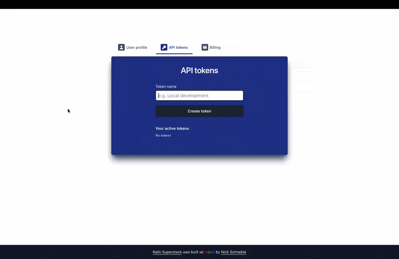
      </a>
      <br /><sub><em>API Tokens</em></sub>
    </td>
    <td align="center">
      <a href="public/screenshots/stripe.gif">
        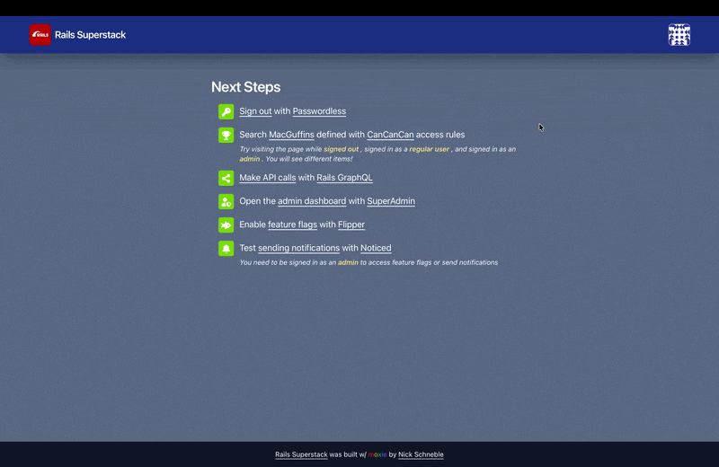
      </a>
      <br /><sub><em>Stripe Subscriptions</em></sub>
    </td>
    <td align="center">
      <a href="public/screenshots/typesense.gif">
        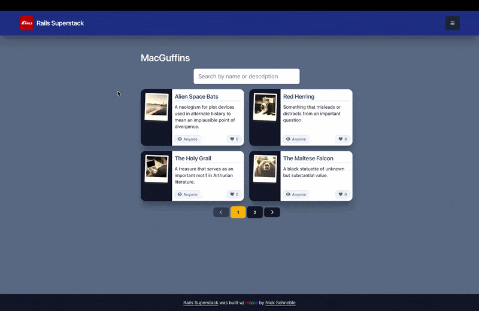
      </a>
      <br /><sub><em>Typesense Search</em></sub>
    </td>
  </tr>
</table>

<p align="right">└─ Click any image to enlarge ─┘</p>

## Table of Contents

- [Getting Started](#getting-started)
  - [Prerequisites](#prerequisites)
  - [Run Rename Script](#run-rename-script)
  - [Set Up Font Awesome](#set-up-font-awesome)
  - [Build and Run](#build-and-run)
- [What's in a Superstack, Exactly?](#whats-in-a-superstack-exactly)
  - [Tech Stack](#tech-stack)
  - [Gems and Resources](#gems-and-resources)
  - [Core Features](#core-features)
  - [Routes](#routes)
- [Linting, Testing, and Code Quality](#linting-testing-and-code-quality)
  - [Linting](#linting)
  - [Testing](#testing)
  - [Code Quality](#code-quality)
  - [Local CI](#local-ci)
- [GraphQL API](#graphql-api)
  - [Getting Auth Tokens](#getting-auth-tokens)
    - [In Rails](#in-rails)
    - [In Terminal](#in-terminal)
  - [Making Queries](#making-queries)
- [Stripe Billing](#stripe-billing)
  - [Set Stripe API Keys](#set-stripe-api-keys)
  - [Subscriptions](#subscriptions)
  - [Purchases](#purchases)
- [Ephemera](#ephemera)
  - [SimpleCov Coverage Badge](#simplecov-coverage-badge)
  - [Cleanup Script](#cleanup-script)
  - [AI Agents](#ai-agents)
- [Acknowledgements](#acknowledgements)

## Getting Started

First things first. [Create a repository](https://docs.github.com/en/repositories/creating-and-managing-repositories/creating-a-repository-from-a-template#creating-a-repository-from-a-template) from this template. It's only two steps!

1. Click on "Use this template" above the file list
2. Select "Create a new repository"

Clone the new repo to your local machine, and you're done! (I suppose that's _technically_ three steps)

### Prerequisites

With your shiny new repo in hand, here's what you need to get cooking:

- [Bundler](https://bundler.io/) v4.0
- PostgreSQL 18
- Redis 8.6
- Ruby 3.4.7
- Typesense Server 30.1

I'd personally recommend [Homebrew](https://brew.sh) and [rbenv](https://rbenv.org) to install these prerequisites:

```bash
cd /path/to/your/repo

# Install Homebrew + Postgres
/bin/bash -c "$(curl -fsSL https://raw.githubusercontent.com/Homebrew/install/HEAD/install.sh)"
brew install postgresql@18

# Install Redis + Typesense
brew install redis
brew install typesense/tap/typesense-server@30.1

# Install rbenv + Ruby
curl -fsSL https://rbenv.org/install.sh | bash
rbenv install 3.4.7

# Install Bundler
gem install bundler

# Start up the services
brew services start postgresql@18
brew services start redis
brew services start typesense-server@30.1
```

### Run Rename Script

Unless you want your app to be called "Rails Superstack", you'll probably want to run this script:

```bash
cd /path/to/your/repo

# Get help
script/rename.sh --help

# Preview changes
script/rename.sh --dry-run

# Run interactively
script/rename.sh

# Run without prompts
script/rename.sh --no-confirmation
```

The script should be clever enough to detect your new repo's origin url. If not, it'll prompt you for it. If _that_ fails, it'll prompt for your GitHub username and repository name.

After the script runs successfully, it'll delete itself and create a new README.

### Set Up Font Awesome

This one's easy. Navigate to [Get Started with Font Awesome](https://fontawesome.com/start) to sign up and add a new icon kit. Create an app configuration using the included `config/application.yml.example` file, then plug in your shiny new kit:

```bash
cd /path/to/your/repo
cp config/application.yml.example config/application.yml
```

Open `config/application.yml` and replace `font_awesome_kit_url` with your kit's url.

### Build and Run

You can install dependencies, set up the database, run migrations – etc. etc. – or you can live on the wild side and run the `setup` script:

```bash
cd /path/to/your/repo

# Set up everything + start the development server
bin/setup

# Set up everything + don't start the development server
bin/setup --skip-server

# Reset back to factory settings
bin/setup --reset
```

Done this song-and-dance before? If you just need to start up the development server, you can skip straight to the end and run the `dev` script:

```bash
cd /path/to/your/repo
bin/dev
```

Open [localhost:3000](http://localhost:3000) in your web browser and you're good to go!

## What's in a Superstack, Exactly?

### Tech Stack

Rails Superstack is a modern Ruby on Rails app, so by default it comes with:

- [Ruby on Rails](https://rubyonrails.org)
- [Hotwire](https://hotwired.dev)
- [Postgres](https://www.postgresql.org)
- [Puma](https://puma.io)
- [RuboCop](https://rubocop.org)
- [Tailwind](https://tailwindcss.com)

### Gems and Resources

Rails Superstack has been preloaded and configured with the following:

- [Strong Migrations](https://github.com/ankane/strong_migrations) (catch unsafe migrations)
- [LogBench](https://github.com/silva96/log_bench) (log viewer)
- [RSpec](https://rspec.info) + [Factory Bot](https://github.com/thoughtbot/factory_bot_rails) + [Faker](https://github.com/faker-ruby/faker) (testing)
- [SimpleCov](https://github.com/simplecov-ruby/simplecov) + [SimpleCov Tailwind](https://simplecov-tailwind.chiefpansancolt.dev/) + [SimpleCov Badger](https://coverage.traels.it/) (code coverage)
- [RubyCritic](https://github.com/whitesmith/rubycritic) (code quality)
- [Passwordless](https://github.com/mikker/passwordless) + [CanCanCan](https://github.com/CanCanCommunity/cancancan) (auth + roles)
- [Letter Opener](https://github.com/ryanb/letter_opener) + [Letter Opener Web](https://github.com/fgrehm/letter_opener_web) (preview emails)
- [Pom Component](https://pom-io.github.io/pom-component) + [Draper](https://github.com/drapergem/draper) (view components + decorators)
- [Font Awesome](https://fontawesome.com) + [Gravatar Image Tag Plugin](https://github.com/mdeering/gravatar_image_tag) (icons)
- [SuperAdmin](https://github.com/ThibautBaissac/super_admin) + [Flipper](https://www.flippercloud.io) (admin + feature flags)
- [Commonmarker](https://github.com/gjtorikian/commonmarker) (syntax highlighting)
- [Resque](http://resque.github.io) (background jobs)
- [Typesense](https://typesense.org) + [Pagy](https://ddnexus.github.io/pagy) (search + pagination)
- [GraphQL](https://rails-graphql.dev) (API)
- [Noticed](https://github.com/excid3/noticed) (notifications)
- [Figaro](https://github.com/laserlemon/figaro) (app configuration)
- [Stripe](https://github.com/stripe/stripe-ruby) (payments + subscriptions)
- [Rails AI Agents](https://github.com/ThibautBaissac/rails_ai_agents) (AI agents)

### Core Features

What works right out of the box?

- Creating user accounts and signing in using magic link authentication
- Creating API tokens and querying the GraphQL API
- Sending in-app (toast) and email notifications
- Searching for models using Typesense and Pagy
- Making Stripe subscriptions and purchases

F*ck yeah, baby.

### Routes

#### User Routes

| Endpoint         | Description                                     |
| ---------------- | ----------------------------------------------- |
| `/billing/plans` | View subscription plans (Stripe)                |
| `/sent_mail`     | Preview sent mail (Passwordless login codes)    |
| `/settings`      | Change email, create API tokens, manage billing |
| `/sign_in`       | Sign in as a new or existing user               |
| `/sign_out`      | Sign out the current user                       |

#### Admin Routes

| Endpoint         | Description          |
| ---------------- | -------------------- |
| `/admin`         | SuperAdmin dashboard |
| `/notifications` | System notifications |
| `/flipper`       | Feature flags        |
| `/resque`        | Background jobs      |

#### Demo Routes

(The [cleanup script](#cleanup-script) will remove these endpoints)

| Endpoint            | Description                                        |
| ------------------- | -------------------------------------------------- |
| `/demo/alert`       | Example for flash alerts (as notification toasts)  |
| `/demo/api`         | GraphQL API routes and examples                    |
| `/demo/mac_guffins` | Placeholder items accessible by the current user   |
| `/demo/notice`      | Example for flash notices (as notification toasts) |
| `/demo/secrets`     | A "secret" route hidden behind a feature flag      |
| `/demo/terminal`    | Lists a few useful terminal commands               |
| `/demo/themes`      | Shows off Stripe purchases as app themes           |
| `/demo/welcome`     | Starter page with helpful links                    |

## Linting, Testing, and Code Quality

There's handy binstubs for RuboCop, RSpec, and RubyCritic. Local CI will mirror the GitHub workflow that runs when you make commits and merge pull requests.

### Linting

```bash
cd /path/to/your/repo

# Lint code for consistent style
bin/rubocop
```

### Testing

```bash
cd /path/to/your/repo

# Run RSpec tests
bin/rspec

# Open SimpleCov coverage report
open simplecov/index.html
```

### Code Quality

```bash
cd /path/to/your/repo

# Run code quality analysis
bin/rubycritic

# Open RubyCritic overview
open rubycritic/overview.html
```

### Local CI

```bash
cd /path/to/your/repo
bin/ci
```

## GraphQL API

GraphQL is a touch different than your vanilla JSON API. The data structures are effectively dynamic, so you can hit a single endpoint to request any sort of data in any sort of order.

An endpoint covers a single GraphQL schema, which could compromise an individual model or literally your entire database. For simplicity and clarity, this repo has two schemas to disambiguate between common and demo endpoints.

[Learn more about GraphQL](https://graphql.org/learn/)

### Getting Auth Tokens

The API uses token-based authentication. You'll need a bearer authentication token to make queries to authenticated endpoints.

#### In Rails

You can use `ApiToken.issue!(user:, name:)` to get a bearer auth token in Rails. Pass in `current_user` to query resources available in the current session.

#### In Terminal

There's a one-stop binstub to pipe a bearer auth token directly into your GraphQL queries:

```bash
cd /path/to/your/repo

# Returns "Bearer TOKEN" for direct usage
bin/api-token api@superstack.dev
```

### Making Queries

To query data in GraphQL, you `POST` to an endpoint with your `query` as the payload. The examples below use `curl` to hit the API and pipe the responses to `jq` for pretty formatting in the terminal.

```bash
cd /path/to/your/repo

# health check
curl -s -H 'Content-Type: application/json' \
  -X POST http://localhost:3000/graphql \
  -d '{"query":"{ health { status } }"}' | jq

# users (requires authentication)
bin/api-token | xargs -I% curl -s -H 'Content-Type: application/json' \
  -H 'Authorization: %' -X POST http://localhost:3000/graphql \
  -d '{"query":"{ users { id email role } }"}' | jq

# MacGuffins (requires authentication)
bin/api-token | xargs -I% curl -s -H 'Content-Type: application/json' \
  -H 'Authorization: %' -X POST http://localhost:3000/graphql/demo \
  -d '{"query":"{ macGuffins { id name description } }"}' | jq
```

A response will be nicely formatted JSON data:

```json
# POST /graphql/health
{
  "data": {
    "health": {
      "status": "ok"
    }
  }
}
```

## Stripe Billing

You effectively have Stripe purchases and subscriptions right out of the box! Everything is already wired up from API integrations to webhooks.

**A few key points:**

- To cover the basics of your average paid app, users are linked to subscriptions with free and paid options. Paid plans can be monthly or yearly.
- Stripe webhook listeners don't run automatically. I mean, what if you don't need them? Use the `--with-stripe` argument when starting your development server:

```bash
cd /path/to/your/repo
bin/dev --with-stripe
```

### Set Stripe API Keys

It always starts with API keys. There are placeholders in `config/application.yml` to replace with your [Stripe test keys](https://dashboard.stripe.com/test/apikeys). Never commit real keys!

```yaml
stripe_secret_key:      sk_test_REPLACE_ME
stripe_publishable_key: pk_test_REPLACE_ME
stripe_signing_secret:  whsec_REPLACE_ME
```

You can obtain your `stripe_signing_secret` when you run `bin/dev --with-stripe` for the first time. You'll see terminal output like the following:

```bash
22:58:43 stripe.1    | Ready! You are using Stripe API Version [2017-12-14]. Your webhook signing secret is whsec_REPLACE_ME (^C to quit)
```

### Subscriptions

To allow your users to sign up for paid subscriptions, you only have to do a few things:

1. Create two products in the Stripe catalog (one each for monthly and yearly)
2. Copy the price ids into `stripe_price_pro_monthly` and `stripe_price_pro_yearly` in `config/application.yml`. **These aren't product ids!** On each product page there's a "Pricing" section with a dropdown menu (...) where you can copy the price id.
3. Match the `price_monthly_cents` and `price_yearly_cents` in `app/models/billing/pro_plan.rb` to your product prices

That's it! Visit `/billing/plans` or `/settings/billing` as a logged-in user, and everything should just work!

### Purchases

Amazingly, you don't need to do ANYTHING to make Stripe purchases. They can be handled entirely programmatically through the Stripe API.

The demo code has "super premium themes" as a fully implemented example. Visit `/demo/themes` as a logged-user to buy them!

**Want to roll your own?** There are four relevant files:

```
app/models/demo/themes/theme_purchase.rb
app/services/demo/themes/complete_purchase_service.rb
app/services/demo/themes/create_checkout_session_service.rb
config/initializers/demo/billing_checkout_handlers.rb
```

- `billing_checkout_handlers.rb` is used to register the payment webhook handlers that get called when you complete a Stripe purchase
- `create_checkout_session_service.rb` performs a Stripe purchase
- `complete_purchase_service.rb` is called when you complete a Stripe purchase
- `theme_purchase.rb` is the database model linked to the Stripe purchase

Replicate (or edit) these for your own unique Stripe purchases!

## Ephemera

### SimpleCov Coverage Badge

When you run RSpec tests, a SimpleCov coverage report is created at `coverage/index.html` in your repo. This is great! The SimpleCov Tailwind gem makes it look buttery smooth. This is better! But the SimpleCov Badger gem? It lets you add a repo badge to your README. This is BEST.

You can follow the [SimpleCov Badger instructions](https://github.com/traels-it/simplecov_badger?tab=readme-ov-file#installation), but it's already configured in Rails Superstack, so you really just need to do three things:

1. Get an API token
  1. Run `bin/rails simplecov_badger:install` to get an API token
  2. Set `simplecov_badger_token` in `config/application.yml`
  3. Add a new GitHub repo secret for `SIMPLECOV_BADGER_TOKEN`
2. Commit to `main` (so CI runs)
  1. Check the "Run RSpec tests" console output from GitHub CI
  2. Copy the badge url
3. Update your README
  1. Add ``````
  2. Done!

### Cleanup Script

Dislike the demo code with a passion? Easy! Burn it with 🔥 fire 🔥 by running the cleanup script:

```bash
cd /path/to/your/repo

# Get help
script/cleanup.sh --help

# Preview changes
script/cleanup.sh --dry-run

# Run interactively
script/cleanup.sh

# Run without prompts
script/cleanup.sh --no-confirmation
```

The script removes all trace of demo code from the template. This includes assets, controllers, helpers, models, views, routes, seeds, and specs.

Cleanup also inserts migrations to remove the demo tables and then regenerates the schema by dropping and recreating the local database.

After the script runs successfully, it deletes itself and you’ll be left with a pristine template.

### AI Agents

This project integrates [Rails AI Agents](https://github.com/ThibautBaissac/rails_ai_agents), a suite of specialist Claude Code agents designed around Rails conventions. They were used in part to build Rails Superstack!

What's included:

- Specialist agents for each Rails layer (models, services, controllers, etc.)
- TDD orchestration
- Spec-Driven Development (SDD) commands
- Sentry integration
- Enforcement rules aligned with the project's architecture and conventions

## Acknowledgements

The Rails Superstack logo was crafted from an illustration by [Muhammad Afandi](https://unsplash.com/@kertiaa) on [Unsplash](https://unsplash.com/illustrations/three-stacked-geometric-shapes-on-white-background-VxU_akYKA8Q).
